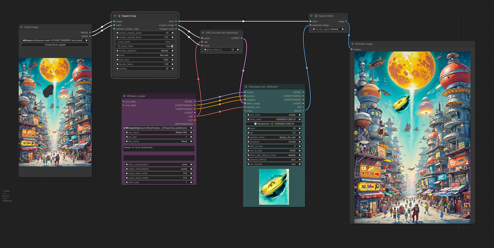
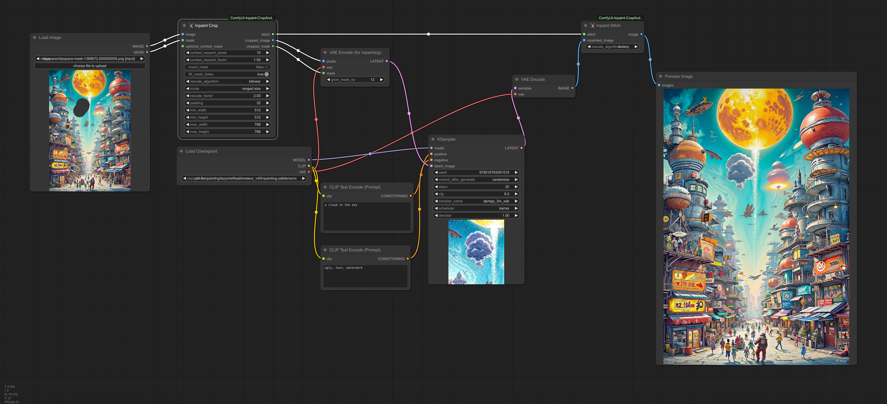
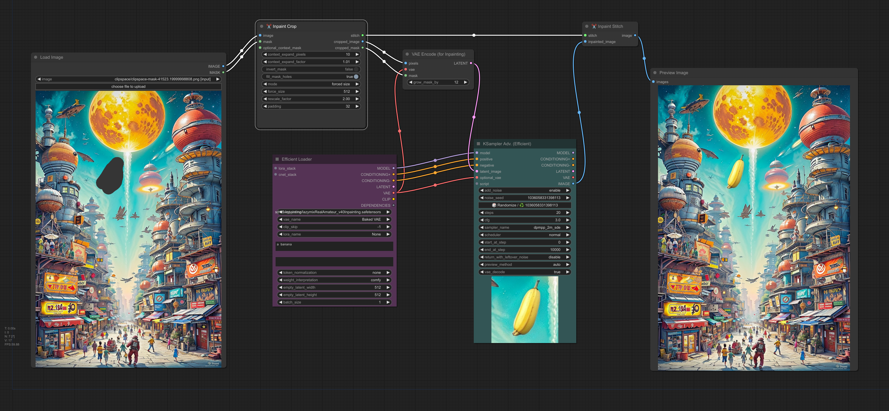

ComfyUI-Inpaint-CropAndStitch

Copyright (c) 2024, Luis Quesada Torres - https://github.com/lquesada | www.luisquesada.com

Check ComfyUI here: https://github.com/comfyanonymous/ComfyUI

# Overview

"✂️  Inpaint Crop" is a node that crops an image before sampling. The context area can be specified via the mask, expand pixels and expand factor or via a separate (optional) mask.

"✂️  Inpaint Stitch" is a node that stitches the inpainted image back into the original image without altering unmasked areas.

-The main advantages of inpainting only in a masked area with these nodes are:
  - It's much faster than sampling the whole image.
  - It enables setting the right amount of context from the image for the prompt to be more accurately represented in the generated picture.
  - It enables upscaling before sampling in order to generate more detail, then stitching back in the original picture.
  - It enables downscaling before sampling if the area is too large, in order to avoid artifacts such as double heads or double bodies.
  - It enables forcing a specific resolution (e.g. 1024x1024 for SDXL models).
  - It doesn't modify the unmasked part of the image, not even passing it through VAE encode and decode.

# Video Tutorial

[](https://www.youtube.com/watch?v=u5cNrumkz2w)

[(click to open in YouTube)](https://www.youtube.com/watch?v=u5cNrumkz2w)

## Parameters
- `context_expand_pixels`: how much to grow the context area (i.e. the area for the sampling) around the original mask, in pixels. This provides more context for the sampling.
- `context_expand_factor`: how much to grow the context area (i.e. the area for the sampling) around the original mask, as a factor, e.g. 1.1 is grow 10% of the size of the mask.
- `invert_mask`: Whether to fully invert the mask, that is, only keep what was marked, instead of removing what was marked.
- `fill_mask_holes`: Whether to fully fill any holes (small or large) in the mask, that is, mark fully enclosed areas as part of the mask.
- `rescale_algorithm`: Rescale algorithm to use. bislerp is for super high quality but very slow, recommended for stich. bicubic is high quality and faster, recommended for crop.
- `mode`: Free size, Forced size, or Ranged size.
    - Free size uses `internal_rescale_factor` to optionally rescale the content before sampling and eventually scale back before stitching, and `padding` to align to standard sizes.
    - Forced size uses `force_width` and `force_height` and upscales the content to take that size before sampling, then downscales before stitching back. Use forced size e.g. for SDXL.
    - Ranged size is like free size but also allows setting `min_width`, `max_width`, `min_height`, and `max_height` to avoid overscaling or underscaling the area.

## Example: Simple free size inpaint
This example inpaints by sampling on a small section of the larger image. It runs ~20x faster than sampling on the whole image.

Download the following example workflow from [here](inpaint-cropandstitch_example_workflow_freesize.json) or drag and drop the screenshot into ComfyUI.



## Example: Context mask
This example inpaints by taking more context from a wider area by using a context mask. It's still faster than sampling on the whole image but generates content with better context.

Download the following example workflow from [here](inpaint-cropandstitch_example_workflow_context_mask.json) or drag and drop the screenshot into ComfyUI.

## Example: Upscaled ranged size inpaint
This example inpaints by upscaling a small section of the larger image, but keeps the image to sample between 512x512 and 768x768 (width and height separately).

Download the following example workflow from [here](inpaint-cropandstitch_example_workflow_rangedsize.json) or drag and drop the screenshot into ComfyUI.



## Example: Upscaled forced size inpaint
This example inpaints by upscaling a small section of the larger image to exactly 512.

Download the following example workflow from [here](inpaint-cropandstitch_example_workflow_forcedsize.json) or drag and drop the screenshot into ComfyUI.



# Installation Instructions

Install via ComfyUI-Manager or go to the custom_nodes/ directory and run ```$ git clone https://github.com/lquesada/ComfyUI-Inpaint-CropAndStitch.git```

## Best Practices
Use an inpainting model e.g. lazymixRealAmateur_v40Inpainting.

Use "VAE Encode (for Inpainting)" with grow_mask_by 12, this feathers the masks a bit.

You may also use Set Latent Noise Mask, but then you may use KJNodes if you want to blur or feather the mask: https://github.com/kijai/ComfyUI-KJNodes/tree/main

If you want to inpaint fast with SD 1.5, use free size with padding 32. You may increase rescale_factor to get more details.

If you want to inpaint with SDXL, use forced size = 1024.

# Changelog
## 2024-06-31
- The node now resorts to outpainting if the context area doesn't fit in the image (e.g. for large masks that wouldn't fit in the image with the desired aspect ratio). This makes forced_size actually force the required size.
- Force_size is now specified as separate force_width and force_height, to match any desired sampling resolution.
- New mode: ranged size, similar to free size but also takes min_width, min_height, max_width, and max_height, in order to avoid over scaling or under scaling beyond desirable limits.
## 2024-05-15
- Depending on the selected mode ("free size" or "forced size") some fields are hidden.
## 2024-05-14
- Batch support.
- Enabled selecting rescaling algorithm and made bicubic the default for crop, which significantly speeds up the process.
## 2024-05-13
- Switched from adjust_to_preferred_sizes to modes: free size and forced size. Forced scales the section rather than growing the context area to fit preferred_sizes, to be used to e.g. force 1024x1024 for inpainting.
- Enable internal_upscale_factor to be lower than 1 (that is, downscale), which can be used to avoid the double head issue in some models.
- Added padding on the croppedp image to avoid artifacts when the cropped image is not multiple of (default) 32
## 2024-05-12
- Add internal_upscale_factor to upscale the image before sampling and then downsizes to stitch it back.
## 2024-05-11
- Initial commit.

# Acknowledgements

This repository uses some code from comfy_extras (https://github.com/comfyanonymous/ComfyUI), KJNodes (https://github.com/kijai/ComfyUI-KJNodes), and Efficiency Nodes (https://github.com/LucianoCirino/efficiency-nodes-comfyui), all of them licensed under GNU GENERAL PUBLIC LICENSE Version 3. 

# License
GNU GENERAL PUBLIC LICENSE Version 3, see [LICENSE](LICENSE)
