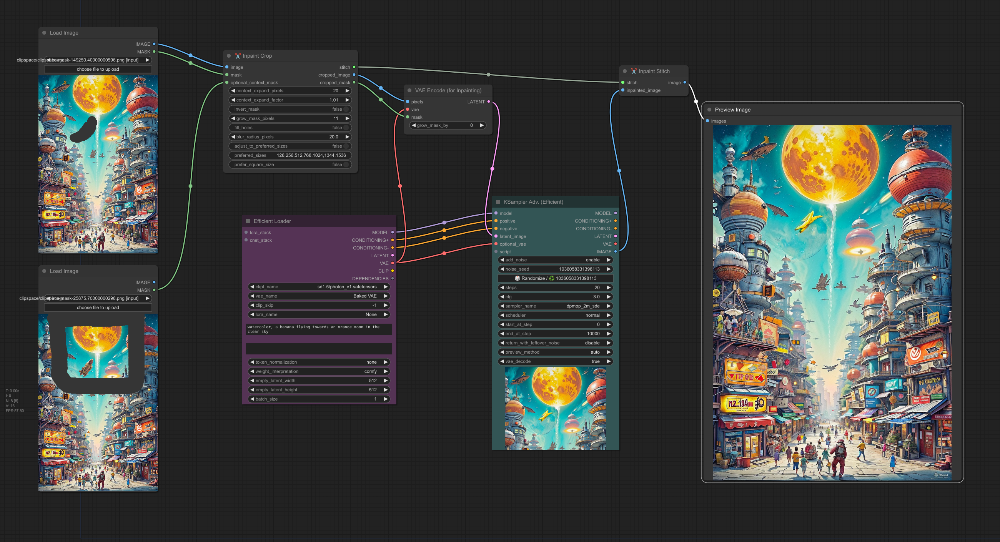

ComfyUI-Inpaint-CropAndStitch
Copyright (c) 2024, Luis Quesada Torres - https://github.com/lquesada | www.luisquesada.com

Check ComfyUI here: https://github.com/comfyanonymous/ComfyUI

# Overview

"✂️  Inpaint Crop" is a node that crops an image before sampling. The context area can be specified via the mask, expand pixels and expand factor or via a separate (optional) mask.

"✂️  Inpaint Stitch" is a node that stitches the inpainted image back into the original image without altering unmasked areas.

## Simple example
This example inpaints by sampling on a small section of the larger image. It runs ~20x faster than sampling on the whole image.

Download the following example workflow from [here](inpaint-cropandstitch_example_workflow.json) or drag and drop the screenshot into ComfyUI.


## Advanced example
This example inpaints by sampling on a small section of the larger image, but expands the context using a second (optional) context mask. It runs ~10x faster than sampling on the whole image but allows navigating the tradeoff between context and efficiency.

Download the following example workflow from [here](inpaint-cropandstitch_example_workflow_advanced.json) or drag and drop the screenshot into ComfyUI.



# Installation Instructions

Install via ComfyUI-Manager or go to the custom_nodes/ directory and run ```$ git clone https://github.com/lquesada/ComfyUI-Inpaint-CropAndStitch.git```

# Acknowledgements

This repository uses some code from comfy_extras (https://github.com/comfyanonymous/ComfyUI) and from KJNodes (https://github.com/kijai/ComfyUI-KJNodes), both licensed under GNU GENERAL PUBLIC LICENSE Version 3. 

# License
GNU GENERAL PUBLIC LICENSE Version 3, see [LICENSE](LICENSE)
